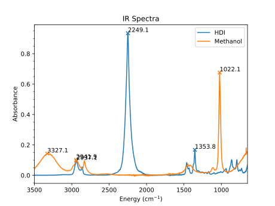
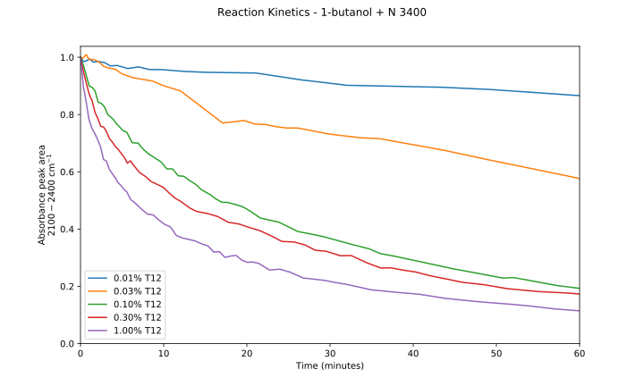

Spectra
=======

Spectra is a package for analyzing and plotting various 1D spectra seen in
chemistry. Spectra can be algebraically manipulated and a variety of helper
functions are included to track peak progress, convolve spectra with various
shapes, and perform peak fitting.

It currently supports plotting the following spectra, but more can easily be added.

- GC
- HPLC
- MS
- NMR
- IR
- Raman
- UV-Vis
- XRD
- XPS

Samples
-------

Contributing
------------
Additional contributions and suggestions are welcome. The intent is to produce
a small, easily usable package for producing quality graphics and assisting in
workflows. Speed is important, as `progress()` regularly needs to read and
manipulate 100+ Spectra at a time.
